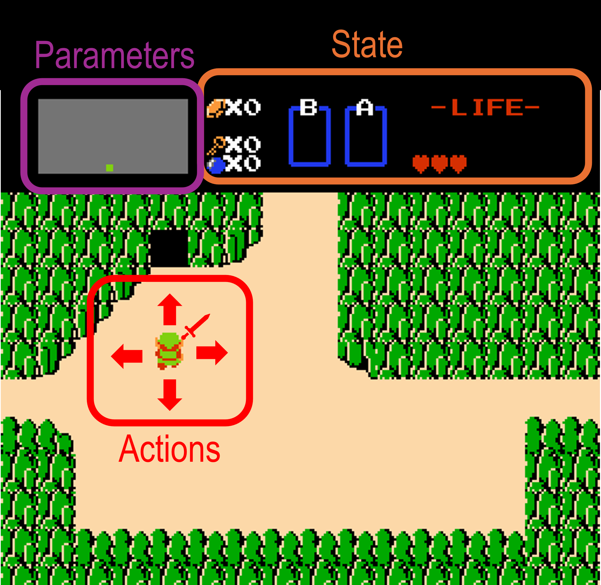

---  
layout: post  
title:  "Surrogate Models: Part 2"  
date:   2024-09-22 12:00:00 -0000  
categories: surrogate modeling  
permalink: /posts/surrogate-models-part-2  
author: Joseph McGuire  
---

  
    <h1>Surrogate Models: Part 2</h1>  
    
Introduction to Data Generation
  

# Introduction to Data Generation

In a [previous post](/posts/surrogate-models-part-1), I started a discussion on surrogate models. These models are ML/AI systems trained on data from underlying physical or digital systems to capture lower-fidelity dynamics. This allows for much faster queries of the system that may not be possible or feasible on the actual system.

Some examples mentioned in the previous post include large climate models, facilities for carbon capture and sequestration, or complex simulation environments. These systems share the characteristic of being impractical for answering questions that require exploring input or design parameters.

For instance, models like [NASA's GEOS-5 system](https://www.nccs.nasa.gov/services/data-collections/coupled-products/geos5-forecast) take multiple hours to evaluate a single climate scenario or forecast. The benefit of a surrogate model is clear: once trained, it takes only milliseconds to evaluate the same scenarios. While the fidelity is lower, the exponentially faster exploration times make this trade-off worthwhile.

Users can query these surrogate models to perform analyses on cause-and-effect structures in the system, such as "An increase in pressure in Wisconsin leads to storms in Nebraska" or "Mario attacking the first Goomba in World 1-1 leads to worse speed-run times."

Overall, the idea I want to convey is that surrogate models, despite their training overhead, can provide users with tools for understanding and querying system structures much faster than the original system.

## Key Concepts in Data Generation

A significant part of the overhead in building surrogate models is **Data Generation**. The systems considered in surrogate modeling typically track three quantities: **state**, **user controls**, and **system parameters**. Determining these quantities isn't always straightforward.

### State Variables

**State** variables track quantities that describe the system, such as carbon emissions from a sequestration facility, temperature or pressure in a climate model, or a character's health in a video game.

### User Controls

**User controls** are variables that the user can change at different points in time, like control knobs on an injection machine at a sequestration facility, climate policies for nation-states, or a character's movement in a video game.

### System Parameters

**System parameters** are variables that usually remain static throughout a run. They are inherent to a system's configuration but may vary across different instances of that system, such as difficulty settings in a game, the type of equipment used at a sequestration facility, or the underlying terrain in a climate model.

### Differentiating Quantities

As mentioned earlier, differentiating these quantities isn't always simple, and they occasionally intersect. Nonetheless, we need to determine and track these quantities when building surrogate models.

Moreover, we'll need variation in these quantities to get a robust surrogate model. For **state** variables, we'll need a lot of variation to capture a robust model of the system. In a video game, state variables might include **health**, **position on screen**, and **mana**. To create a robust surrogate, we need examples of all variations in these quantities.

For example, in **Legend of Zelda**, we need examples of Link's health in all possible variations, such as quarter-heart, full hearts, no hearts, one heart, etc. Additionally, we need variations where Link has full health at specific locations on the screen or relative positions to an enemy.

The combinations of states here scale combinatorially. For example, if we have 13 variations in Link's health, 5 relative positions, and 13 variations in mana, the total number of states would be 13 x 5 x 13 = 845. We also need to track the different states of health of the enemies, such as bokoblins, moblins, and octorocks.

Unfortunately, this gets even more complex when considering continuous health or space. We also need variation in **control actions** and **system parameters**. For instance, Link's health may depend on his movement direction, screen, number of enemies, or enemy locations. **Control actions** here would be Link's movement actions and what he has equipped (e.g., slingshot, bomb, sword, shield). **System parameters** might be the screen or difficulty settings. Therefore, we need the 845 states for different combinations of **control actions** (left, down, up, right, equip sword, equip shield, equip slingshot, equip bomb) and **system parameters** (~200 screens).

The result of a DALLE-3 conversation....

Definitely not Zelda, Zelda..

## Simplifying the Problem

I've made this all sound quite unwieldy, but practically, there are many simplifying assumptions we can make to reduce this problem. For **system parameters**, some screens might be nearly identical, or information like the number of enemies or terrain details could be captured in the **state**, reducing a dimension in **system parameters** variations.

Additionally, **control parameters** might have a linear effect on the state, allowing us to use model predictive controls [1] instead of a switched control scheme [2]. For **state** variations, we might not need every variation and can assume a representative sampling of the space, which I'll discuss more next time. Techniques like active learning [3] can update the robustness of initial models on state prediction.

Next time, I'll delve into these complexity reduction techniques for creating surrogate models. Stay tuned!

## References  
1. Schwenzer, M., Ay, M., Bergs, T., & Abel, D. (2021). Review on model predictive control: An engineering perspective. The International Journal of Advanced Manufacturing Technology, 117(5), 1327-1349.  
2. Blischke, M., & Hespanha, J. P. (2023, December). Learning switched Koopman models for control of entity-based systems. In 2023 62nd IEEE Conference on Decision and Control (CDC) (pp. 6006-6013). IEEE.  
3. Settles, B. (2009). Active learning literature survey.